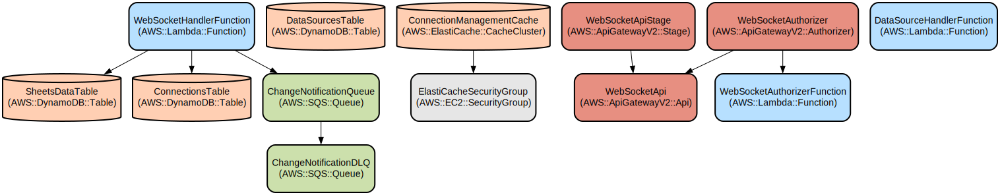

# Real-Time Google Sheets Integration System with External Data Source Support

A scalable AWS-based system that provides real-time synchronization between Google Sheets and external data sources through WebSocket connections. The system enables live data updates, supports multiple data formats (JSON/XML), and includes comprehensive API management capabilities.

The system monitors both Google Sheets and external data sources for changes, processes the updates through AWS Lambda functions, and delivers real-time notifications to connected clients via WebSocket connections. It features robust error handling, automatic reconnection logic, and secure API key management through AWS Secrets Manager.

Key features include:
- Real-time WebSocket connections for instant data updates
- Support for both Google Sheets and external data sources (JSON/XML)
- Secure authentication and authorization
- Scalable infrastructure using AWS managed services
- Comprehensive API documentation with OpenAPI specifications
- Mock API endpoints for testing and development

## Repository Structure
```
.
├── architecture_diagram.txt          # System architecture visualization
├── boiler_plate/                    # Main application code
│   ├── api-docs/                    # API documentation and OpenAPI specs
│   │   ├── api-stubs-openapi.yaml   # Mock API endpoints specification
│   │   └── openapi.yaml            # Main API specification
│   ├── api-stubs/                   # Mock API implementation for testing
│   │   ├── server.js               # Mock API server
│   │   └── test-client.html        # Test client for mock APIs
│   ├── client/                      # Client-side implementation
│   │   └── index.html              # WebSocket client interface
│   ├── ecs/                         # Container definitions
│   │   ├── Dockerfile              # Main application container
│   │   └── external-source-monitor/ # External source monitoring service
│   ├── infrastructure/             # AWS infrastructure definitions
│   │   └── cloudformation.yaml     # CloudFormation template
│   └── lambda/                     # AWS Lambda functions
│       ├── datasource-handler/     # Data source management
│       └── websocket-handler/      # WebSocket connection handling
```

## Usage Instructions
### Prerequisites
- AWS Account with appropriate permissions
- Node.js 16.x or later
- Docker for container builds
- AWS CLI configured with appropriate credentials

### Installation

1. Clone the repository:
```bash
git clone <repository-url>
cd real-time-sheets-integration
```

2. Install dependencies for each component:
```bash
# Install API stubs dependencies
cd boiler_plate/api-stubs
npm install

# Install Lambda function dependencies
cd ../lambda/datasource-handler
npm install
cd ../websocket-handler
npm install

# Install ECS application dependencies
cd ../../ecs
npm install
cd external-source-monitor
npm install
```

3. Deploy AWS infrastructure:
```bash
# Deploy CloudFormation stack
aws cloudformation deploy \
  --template-file boiler_plate/infrastructure/cloudformation.yaml \
  --stack-name real-time-sheets-integration \
  --parameter-overrides \
    Environment=dev \
    SubnetId=subnet-xxxxxx \
    SheetsMonitorECRUri=xxxx.dkr.ecr.region.amazonaws.com/sheets-monitor \
    ExternalSourceMonitorECRUri=xxxx.dkr.ecr.region.amazonaws.com/external-monitor
```

### Quick Start

1. Start the mock API server for testing:
```bash
cd boiler_plate/api-stubs
npm start
```

2. Open the test client in a browser:
```bash
open boiler_plate/api-stubs/test-client.html
```

3. Connect to WebSocket API:
```javascript
const ws = new WebSocket('wss://<api-id>.execute-api.<region>.amazonaws.com/dev');
ws.onopen = () => console.log('Connected');
```

### More Detailed Examples

1. Subscribe to a Google Sheet:
```javascript
ws.send(JSON.stringify({
  action: 'subscribe',
  sheetId: 'your-sheet-id'
}));
```

2. Subscribe to an external data source:
```javascript
ws.send(JSON.stringify({
  action: 'subscribe',
  sourceId: 'stocks-api',
  sourceType: 'external'
}));
```

### Troubleshooting

1. WebSocket Connection Issues
- Error: "Connection refused"
  - Verify API Gateway endpoint URL
  - Check authorization token
  - Ensure proper IAM permissions

2. Data Updates Not Received
- Enable debug logging:
```javascript
const ws = new WebSocket('wss://<api-id>.execute-api.<region>.amazonaws.com/dev');
ws.onmessage = (event) => console.log('Received:', event.data);
```
- Check CloudWatch logs for Lambda functions

## Data Flow

The system processes data through a multi-stage pipeline that handles both Google Sheets and external data sources.

```ascii
[Google Sheets API] --> [Lambda Processor] --> [DynamoDB] --> [WebSocket API] --> [Client]
[External Sources] --> [ECS Monitor] --------^
```

Key component interactions:
1. Change detection services monitor data sources
2. Updates are sent to SQS queues for processing
3. Lambda functions process updates and store in DynamoDB
4. WebSocket connections receive real-time notifications
5. Client applications display live updates

## Infrastructure



AWS Resources defined in CloudFormation:

Lambda Functions:
- websocket-authorizer-{Environment}: Handles WebSocket authorization
- websocket-handler-{Environment}: Manages WebSocket connections
- datasource-handler-{Environment}: Manages data sources

DynamoDB Tables:
- sheets-data-{Environment}: Stores Google Sheets data
- data-sources-{Environment}: Stores data source configurations
- websocket-connections-{Environment}: Manages WebSocket connections

Other Resources:
- ElastiCache Redis cluster for connection management
- SQS queues for change notifications
- API Gateway WebSocket API
- Security groups and IAM roles